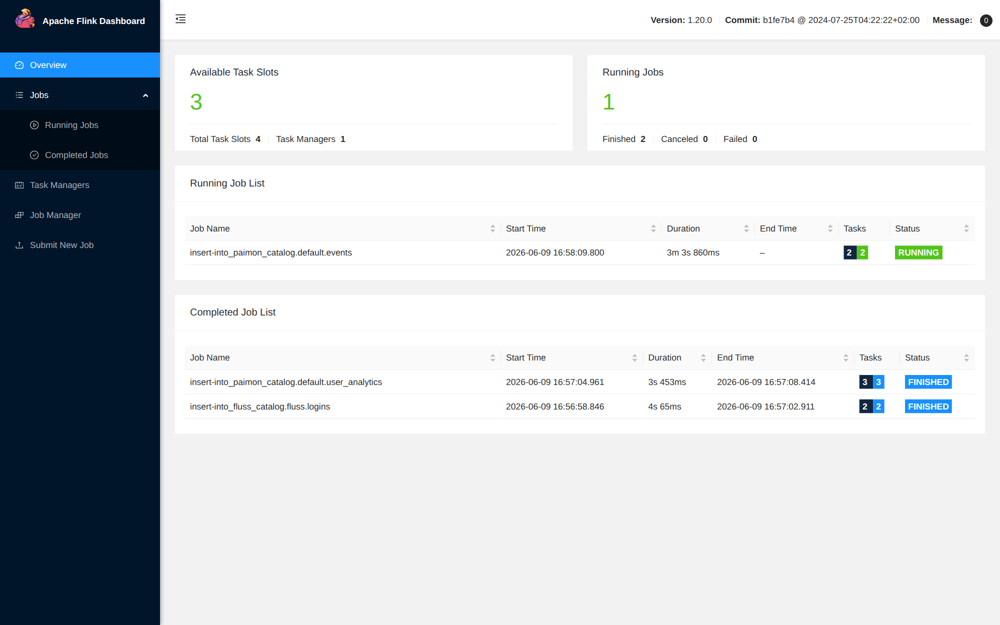
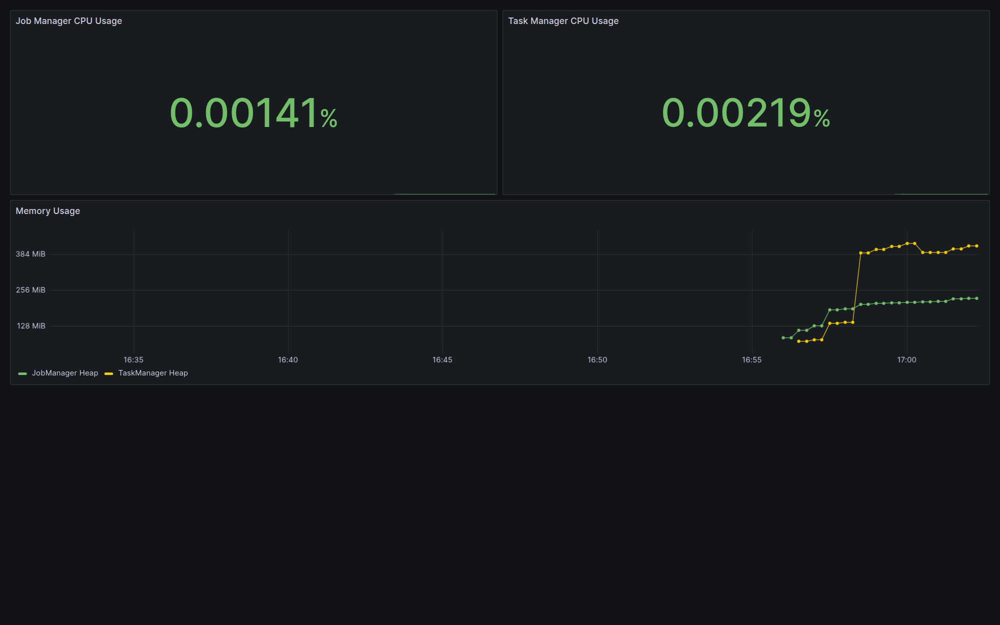
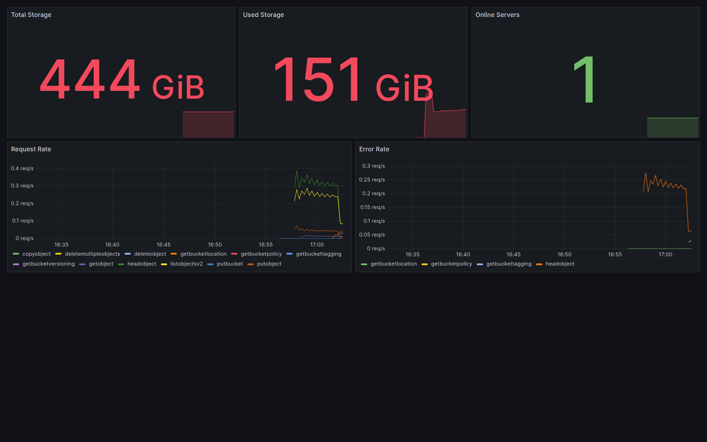
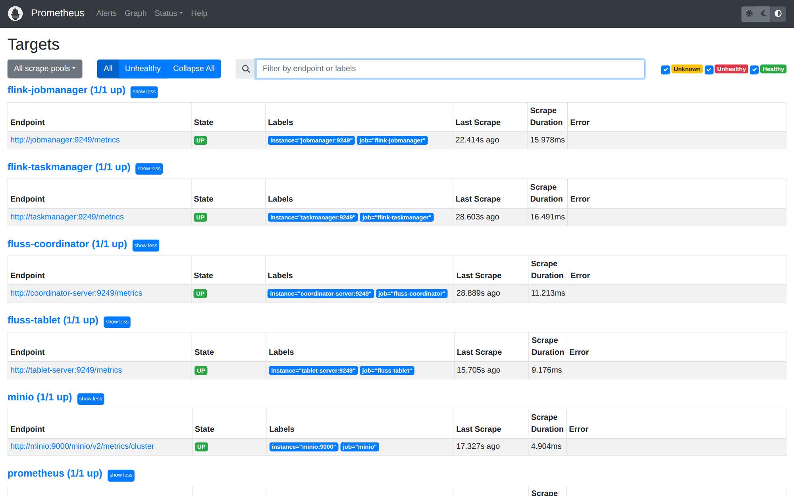

# Fluss, Flink and Paimon Demo

A self-contained Docker Compose environment for learning how Apache Fluss, Apache Flink and Apache Paimon work together. Start the stack, open a SQL client, and explore real-time ingestion alongside lakehouse analytics in under five minutes.

**What this demonstrates:**

- Ingest data into Fluss for fast primary-key lookups and real-time updates
- Store data in Paimon on S3 (MinIO) for flexible analytics queries
- Use Flink SQL as the unified query engine across both systems
- Monitor the full stack with Prometheus and Grafana

## Architecture

```
                  ┌──────────────┐
                  │  ZooKeeper   │
                  └──────┬───────┘
                         │
          ┌──────────────┼──────────────┐
          │                             │
  ┌───────┴────────┐         ┌─────────┴─────────┐
  │ Fluss          │         │ Fluss             │
  │ Coordinator    │         │ Tablet Server     │
  └───────┬────────┘         └─────────┬─────────┘
          │                            │
          └──────────┬─────────────────┘
                     │
  ┌──────────────────┼──────────────────┐
  │ Flink JobManager │ Flink TaskManager │
  └──────────────────┼──────────────────┘
                     │
              ┌──────┴──────┐
              │    MinIO    │
              │ (S3 storage)│
              └──────┬──────┘
                     │
        ┌────────────┼────────────┐
        │ Prometheus │  Grafana   │
        └────────────┴────────────┘
```

## Component Versions

| Component  | Version | Role |
|------------|---------|------|
| Fluss      | 0.9.1-incubating | Stream-batch unified storage with primary-key tables |
| Flink      | 1.20    | SQL and stream/batch processing engine |
| Paimon     | 1.3.1   | Data lake table format (JARs added at build time) |
| MinIO      | RELEASE.2025-09-07T16-13-09Z | S3-compatible object storage |
| MinIO Client (mc) | RELEASE.2025-08-13T08-35-41Z | Creates the S3 buckets on startup |
| ZooKeeper  | 3.9.2   | Coordination service for Fluss |
| Prometheus | 2.45.0  | Metrics collection |
| Grafana    | 10.0.0  | Metrics dashboards |

The demo runs on the official Apache Fluss 0.9.1 images (`apache/fluss` and `apache/fluss-quickstart-flink:1.20-0.9.1-incubating`) on Flink 1.20. Flink 2.2 is not adopted yet: the Fluss quickstart image is published for Flink 1.20, so moving to 2.2 needs a matching quickstart image and a Fluss connector validated on 2.2. Flink reads `conf/config.yaml` in the current standard format.

## Prerequisites

- Docker Engine 20.10+ with Compose V2
- Around 4 GB of free memory (the JVMs are the main consumers)
- Ports 3000, 8083, 9000, 9001, 9090, 9249 and 9250 available on localhost

## Getting Started

Build and start all services:

```bash
docker compose up -d --build
```

Wait for the healthchecks to pass (roughly 60 seconds), then verify:

```bash
docker compose ps
```

All containers should show `Up` (except `minio-init`, which exits after creating the S3 buckets).

Open the Flink SQL client:

```bash
docker exec -it flink-jobmanager /opt/flink/bin/sql-client.sh
```

To tear everything down, including volumes:

```bash
docker compose down -v
```

## Smoke Test

To check the whole demo from a clean checkout in one command:

```bash
scripts/smoke-test.sh
```

It validates the Compose config, starts the stack, waits for the services to be healthy, runs the Fluss catalog walkthrough (create table, insert rows, primary-key lookup), and tears the stack down. It exits non-zero if a health check or the SQL validation fails. Set `KEEP_STACK=1` to leave the stack running for debugging.

## Web UIs

| Service    | URL                        | Credentials     |
|------------|----------------------------|-----------------|
| Flink      | http://localhost:8083       | none            |
| MinIO      | http://localhost:9001       | admin/password123 |
| Prometheus | http://localhost:9090       | none            |
| Grafana    | http://localhost:3000       | admin/admin     |



## Walkthrough

The steps below run entirely inside the Flink SQL client. They create tables in both Fluss and Paimon, load sample data, and show how each system handles different query patterns.

### 1. Set up the Fluss catalog

```sql
CREATE CATALOG fluss_catalog WITH (
  'type' = 'fluss',
  'bootstrap.servers' = 'coordinator-server:9123'
);

USE CATALOG fluss_catalog;
```

### 2. Create a table and insert data into Fluss

```sql
CREATE TABLE logins (
  id STRING,
  username STRING,
  ts TIMESTAMP(3),
  ip STRING,
  PRIMARY KEY (id) NOT ENFORCED
);

INSERT INTO logins VALUES
  ('1', 'alice', TIMESTAMP '2025-09-03 09:00:00', '10.0.0.5'),
  ('2', 'bob',   TIMESTAMP '2025-09-03 09:05:00', '10.0.0.8'),
  ('3', 'alice', TIMESTAMP '2025-09-04 09:05:00', '10.0.0.5');
```

### 3. Query Fluss by primary key

Fluss is optimised for primary-key lookups. Switch to batch mode and query by `id`:

```sql
SET 'sql-client.execution.result-mode' = 'tableau';
SET 'execution.runtime-mode' = 'batch';

SELECT * FROM logins WHERE id = '1';
```

### 4. Start the Lakehouse Tiering Service

Fluss tiers datalake-enabled tables into Paimon through a tiering job that runs on the Flink cluster. Start it once (it keeps running in the background and appears as a job in the Flink Web UI):

```bash
docker compose exec jobmanager /opt/flink/bin/flink run -d \
  /opt/flink/opt/fluss-flink-tiering-0.9.1-incubating.jar \
  --fluss.bootstrap.servers coordinator-server:9123 \
  --datalake.format paimon \
  --datalake.paimon.metastore filesystem \
  --datalake.paimon.warehouse s3://warehouse/ \
  --datalake.paimon.s3.endpoint http://minio:9000 \
  --datalake.paimon.s3.access-key admin \
  --datalake.paimon.s3.secret-key password123 \
  --datalake.paimon.s3.path.style.access true
```

### 5. Create a datalake-enabled table and write once

In the SQL client, create a Fluss table with tiering enabled and insert data once. There is no separate manual insert into Paimon; the tiering service moves the data for you.

```sql
USE CATALOG fluss_catalog;

CREATE TABLE logins_lake (
  id STRING,
  username STRING,
  ts TIMESTAMP(3),
  ip STRING,
  PRIMARY KEY (id) NOT ENFORCED
) WITH (
  'table.datalake.enabled' = 'true',
  'table.datalake.freshness' = '30s'
);

INSERT INTO logins_lake VALUES
  ('1', 'alice', TIMESTAMP '2025-09-03 09:00:00', '10.0.0.5'),
  ('2', 'bob',   TIMESTAMP '2025-09-03 09:05:00', '10.0.0.8'),
  ('3', 'alice', TIMESTAMP '2025-09-04 09:05:00', '10.0.0.5');
```

### 6. Read the hot path and the lake path

Wait about one `table.datalake.freshness` interval (30s) for the tiering service to commit a Paimon snapshot, then read.

Hot path, a low-latency Fluss primary-key lookup (a union of the hot Fluss data and the tiered Paimon data):

```sql
SET 'sql-client.execution.result-mode' = 'tableau';
SET 'execution.runtime-mode' = 'batch';

SELECT * FROM logins_lake WHERE id = '1';
```

Lake path, reading the tiered data straight from Paimon through the `$lake` suffix:

```sql
SELECT * FROM logins_lake$lake ORDER BY id;
```

The `$lake` rows carry Paimon's tiering columns (`__bucket`, `__offset`, `__timestamp`). You can also point a Paimon catalog at `s3://warehouse/` and read the tiered table directly as `fluss.logins_lake`.

### 7. Why Fluss is the hot path and Paimon is the lake path

| Query type | Fluss (hot) | Paimon (lake, via `$lake`) |
|---|---|---|
| Lookup by primary key | Fast | Supported |
| Filter on non-key columns | Not supported in batch mode | Fast |
| Aggregations / GROUP BY | Not supported in batch mode | Fast |
| Storage | Sub-second, local | Columnar files on S3, cheap to scan |

Fluss serves fresh primary-key reads and writes; the same rows land in Paimon as columnar snapshots on object storage for scans and analytics, populated automatically by tiering rather than a second manual insert.

## Monitoring

Prometheus scrapes these targets:

- **Flink JobManager** (port 9249) and **TaskManager** (port 9250) via the Prometheus metrics reporter
- **Fluss Coordinator** and **Tablet Server** (port 9249) via the Fluss Prometheus metrics reporter
- **MinIO** cluster metrics via `/minio/v2/metrics/cluster`

Grafana ships with three pre-provisioned dashboards:

- **Flink Monitoring** -- JVM CPU load and heap memory for both JobManager and TaskManager
- **Fluss Monitoring** -- cluster health (active tablet servers, tables, buckets, offline buckets), tablet server request rate, errors and latency, replica and leader counts, and coordinator JVM usage
- **MinIO Monitoring** -- total and used storage, online server count, request rate and error rate







## Project Structure

```
.
├── conf/
│   ├── config.yaml                  # Flink configuration (S3, metrics, logging)
│   └── log4j-console.properties     # Flink log4j config
├── monitoring/
│   ├── prometheus.yml               # Prometheus scrape targets
│   └── grafana/
│       └── provisioning/
│           ├── dashboards/          # Grafana dashboard JSON files
│           └── datasources/         # Prometheus datasource config
├── docker-compose.yml               # All services
├── Dockerfile                       # Flink image with Paimon, Hadoop, and Fluss lake JARs
├── Dockerfile.fluss                 # Fluss server image with the Paimon S3 filesystem
└── README.md
```

## Troubleshooting

**S3 / MinIO connection errors**

Check that MinIO is healthy and the buckets exist:

```bash
docker compose ps minio
docker compose exec minio mc ls local/warehouse
```

You can also browse buckets in the MinIO UI at http://localhost:9001.

**Cross-catalog queries fail**

Flink SQL does not support cross-catalog references like
`SELECT * FROM fluss_catalog.default.logins` when issued from a different
current catalog. Always `USE CATALOG <name>` before querying its tables.

**Fluss only returns results for primary-key filters**

This is expected. In batch mode, Fluss only supports queries that filter on
the primary key. Use Paimon for scans, aggregations, and non-key filters.

**Useful diagnostic commands**

```sql
SHOW CATALOGS;
SHOW TABLES;

USE CATALOG fluss_catalog;
SHOW TABLES;

USE CATALOG paimon_catalog;
SHOW TABLES;
```
